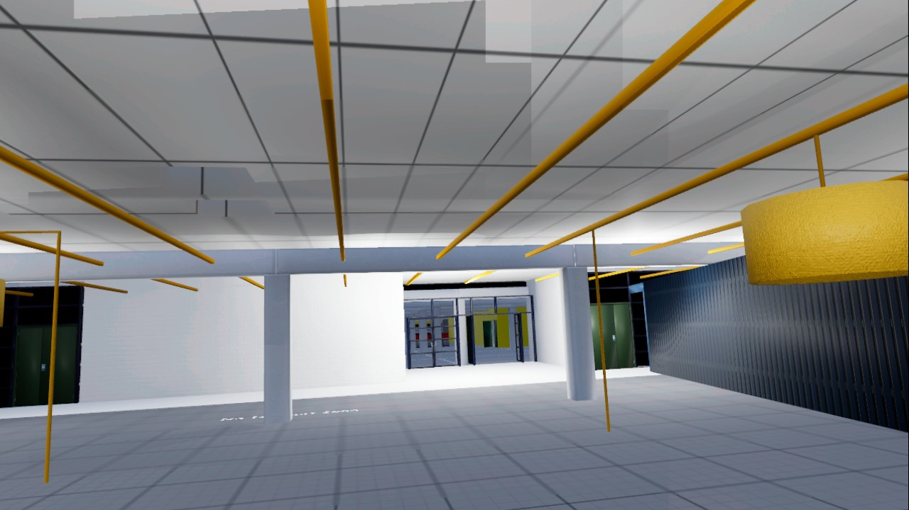

# Immersive CO₂ Visualization and Prediction in XR

This repository contains the source code and documentation for my Master’s thesis project:  
**Exploring the Potential of Immersive Data Visualization and Generative AI–Driven Forecasting in Extended Reality (XR)** (University of Oulu, 2025).

The project integrates **real-time sensor data**, **deep learning–based CO₂ forecasting**, and an **immersive VR frontend** developed in Unreal Engine 5. The goal is to improve environmental awareness by visualizing current and predicted CO₂ levels within an interactive XR environment.

---

## Features
- **Real-time Data Acquisition**: Connects to the University of Oulu **Smart Campus API** for live CO₂ readings.
- **Predictive AI Layer**: Hyperparameter-tuned GRU model forecasts short-term CO₂ levels.
- **Flask Backend**: Serves RESTful endpoints for real-time and predicted CO₂ data.
- **Unreal Engine 5 Frontend**: VR environment (Meta Quest) that displays live and future CO₂ trends using immersive charts, meters, and campus 3D models.
- **Modular Architecture**: Separate layers for data acquisition, AI inference, and XR visualization.
- **Extensible**: Can be extended with new sensors, AI models, or visualization strategies.

---

## Repository Structure
├── run.py # Entry point for Flask server
├── requirements.txt # Python dependencies
├── .env.example # Example environment variables (do not commit secrets)
├── app/
│ ├── init.py # Flask app factory
│ ├── config.py # Config & file paths
│ ├── routes/ # API routes (e.g., /co2, /predict_co2, /co2-graph)
│ ├── services/ # Prediction service
│ ├── infra/ # Model loading, Smart Campus API client
│ └── utils/ # Helper functions (e.g., time, plotting)
└── models/ # AI models & scalers (ignored by Git, tracked via Git LFS if needed)

---

## Getting Started

### 1. Clone the repo
git clone https://github.com/<your-username>/<your-repo>.git
cd <your-repo>

### 2.Setup the Environment
python -m venv .venv
.venv\Scripts\activate   # Windows
source .venv/bin/activate  # macOS/Linux

### 3. Install Dependencies
pip install -r requirements.txt

### 4. Configure environment

Copy .env.example to .env and add your Smart Campus API credentials:
SCDM_EMAIL=your.email
SCDM_PASSWORD=your_password

### 5. Run the Flask server
python run.py

Server runs at: http://127.0.0.1:5000

---

## API Endpoints
Get recent CO₂ values
GET /co2?deviceui=A81758FFFE03101B

Returns last values + timestamps.

Get CO₂ prediction
GET /predict_co2?sensor_id=A81758FFFE03101B

Returns 60-minute forecast.

Get CO₂ graph
GET /co2-graph?deviceui=A81758FFFE03101B

Returns PNG chart of recent readings.

---

## Unreal Engine Integration

- Engine: Unreal Engine 5.5.4
- Plugin: VaRest
 for REST requests & JSON parsing
- XR Device: Meta Quest 3
- Visualization: 3D bar charts, wall displays, and interactive meters showing live and predicted CO₂ values
- Assets: 3D model of the University of Oulu campus

Unreal communicates with Flask via HTTP calls, fetching real-time and predicted values every 60s.

## Results (Summary)

- Best Model: GRU (RMSE = 16.22, R² = 0.9847)
- System Latency: ~3.6s for real-time fetch, ~8.5s for AI prediction
- Performance: Maintained ~40 FPS on Meta Quest 3 under load
- Insights: Predictive AI integration is feasible in XR but GPU optimization is essential.

## Screenshots
### VR bar chart of CO₂ values

- Campus 3D model environment

## Tech Stack

- Backend: Python, Flask, TensorFlow/Keras, scikit-learn
- Frontend: Unreal Engine 5, VaRest plugin, Blueprints
- AI Models: GRU (tuned), LSTM, Transformer (for comparison)
- Data Source: University of Oulu Smart Campus API